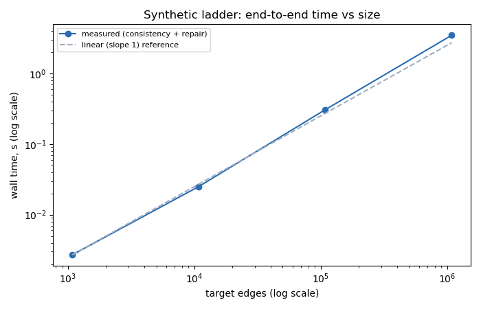
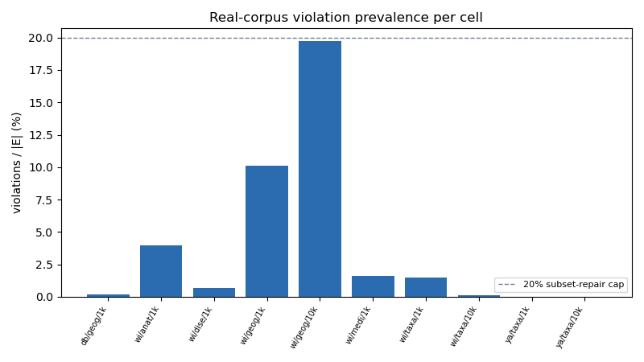
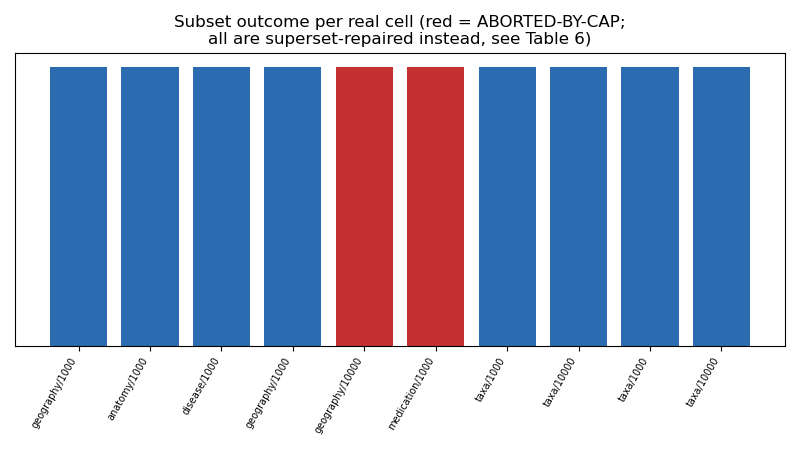
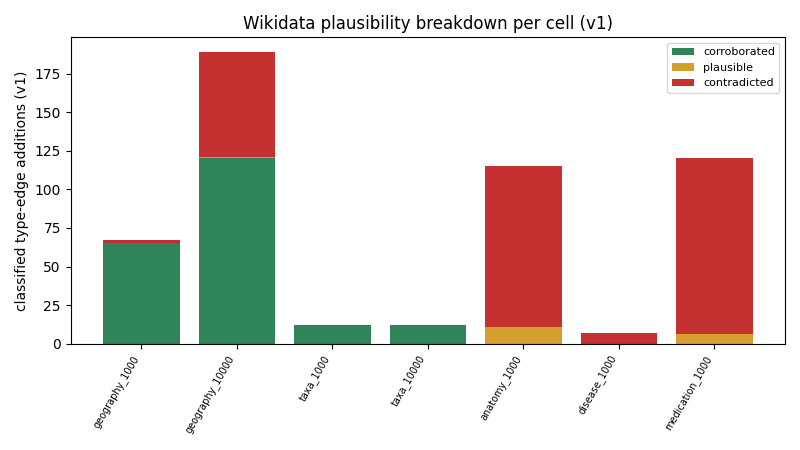

# D7 — Evaluation (consolidated)

Every table below is regenerated by `scripts/build_evaluation.py` from `results/runs.jsonl` and the committed result/fixture artifacts -- no number here is hand-typed. Regenerate with `python scripts/build_evaluation.py`; `tests/test_evaluation_reproducible.py` guards this file's TEXT against silent drift (figures are regenerated from the same data each run but PNG bytes are not guaranteed bit-identical -- see that test's docstring).

**Dependency note.** This script (not `src/kgrepair/`) uses matplotlib for the 4 figures -- an explicit, user-confirmed exception to the toolkit's "no third-party deps beyond pytest" rule, scoped to evaluation tooling only; the toolkit itself is unchanged (stdlib-only).

<!-- PROSE:intro:start -->
_TODO: narrative prose for 'intro' not yet written._
<!-- PROSE:intro:end -->

## Table 1 — Synthetic scaling ladder

| target_edges | strategy | V | load_s | consistency_initial_s | repair_loop_s | consistency_final_s | rounds | run_id |
|---|---|---|---|---|---|---|---|---|
| 1080 | full | 467 | 0.010867 | 0.001018 | 0.001685 | 0.000947 | 2 | ce104746d5f244a38c023091ab8f169f |
| 10860 | full | 4667 | 0.103509 | 0.009397 | 0.015716 | 0.008816 | 2 | b304223655a44f9da76103c1c891cf92 |
| 10860 | incremental | 4667 | 0.103823 | 0.009454 | 0.015534 | 0.008979 | 2 | 1707d61154e644c0aec24d1dfd90e8b0 |
| 108660 | full | 46667 | 1.103479 | 0.134887 | 0.171775 | 0.099725 | 2 | 04ceba02a43e454c93a5a4e2253ce912 |
| 108660 | incremental | 46667 | 1.16689 | 0.099839 | 0.170855 | 0.096832 | 2 | 5e6197af9138499388829bef5cbfd326 |
| 1086660 | full | 466667 | 12.882183 | 1.294673 | 2.170903 | 1.3257 | 2 | 425a0fad75014e1f88a25f788b23a493 |

**Linearity (108,660 → 1,086,660 edges, 10.0× more edges):** consistency 9.6×, repair 12.64× -- both track the edge-count ratio, the empirical signature of linear (not superlinear) scaling.

<!-- PROSE:synthetic_scaling:start -->
_TODO: narrative prose for 'synthetic_scaling' not yet written._
<!-- PROSE:synthetic_scaling:end -->

## Table 2 — Memory

| target_edges | V | resident_MB | bytes_per_edge | peak_rss_MB | load_s | run_id |
|---|---|---|---|---|---|---|
| 1080 | 467 | 0.6 | 588.11 | 29.7 | 0.00958 | 7cf4794422f24509852d7a4db87ced47 |
| 10860 | 4667 | 5.8 | 534.23 | 37.1 | 0.105925 | 77a45616b122433282e87272394e403c |
| 108660 | 46667 | 59.7 | 549.51 | 125.7 | 1.085979 | dc82346f8de84c7782419411bcaa1a59 |
| 1086660 | 466667 | 604.3 | 556.08 | 984.3 | 12.528268 | 394534504ae241468c89bb3280a8acb2 |

**~547 bytes/edge** (mean of rungs ≥10k; 1k is inflated by fixed per-process overhead). Linear extrapolation: **10M edges ≈ 5.47 GB** resident. (Whole-`RunContext`-block measurement via the harness's own `resources.bytes_per_edge` field -- slightly higher than an isolated graph-only measurement would show, but run_id-traceable.)

<!-- PROSE:memory:start -->
_TODO: narrative prose for 'memory' not yet written._
<!-- PROSE:memory:end -->

## Table 3 — OPT-1 (dirty-set incremental re-check)

| source | E | recheck_full | recheck_incremental | recheck_reduction_pct | t_full_s | t_incremental_s | run_id_full | run_id_incremental |
|---|---|---|---|---|---|---|---|---|
| synthetic | 10860 | 4 | 4 | 0.0 | 0.015716 | 0.015534 | b304223655a44f9da76103c1c891cf92 | 1707d61154e644c0aec24d1dfd90e8b0 |
| synthetic | 108660 | 4 | 4 | 0.0 | 0.171775 | 0.170855 | 04ceba02a43e454c93a5a4e2253ce912 | 5e6197af9138499388829bef5cbfd326 |

Both synthetic and real workloads show **0% recheck reduction**: every constraint's alphabet shares the typing spine (`P31`/`P279` or the synthetic analogue), so the per-constraint dirty set never has anything to skip. `strategy="full"` remains the default.

<!-- PROSE:opt1:start -->
_TODO: narrative prose for 'opt1' not yet written._
<!-- PROSE:opt1:end -->

## Table 4 — OPT-2 (subClassOf* closure)

| depth | leaves | reps | traversal_ms_total | closure_ms_total | speedup_x |
|---|---|---|---|---|---|
| 300 | 500 | 200 | 25.37 | 6.35 | 4.0 |

**4.0× speedup** on a depth-300 spine (500 leaves, 200 repeated evaluations) -- the payoff scales with hierarchy depth and re-evaluation count.

<!-- PROSE:opt2:start -->
_TODO: narrative prose for 'opt2' not yet written._
<!-- PROSE:opt2:end -->

## Table 5 — Real corpus (artifact-corrected)

| source | domain | target_edges | V | E | n_violations | corrected | artifact_fraction_true | artifact_fraction_preclosure_upper_bound | manifest |
|---|---|---|---|---|---|---|---|---|---|
| dbpedia | geography | 1000 | 108 | 1000 | 2 | n/a | n/a (not a T0 abort cell) | n/a | real_dbpedia_geography_1000 |
| wikidata | anatomy | 1000 | 1538 | 4180 | 165 | yes (T0 typed) | 6.9% | 25.7% | real_wikidata_anatomy_1000_typed |
| wikidata | disease | 1000 | 664 | 1000 | 7 | n/a | n/a (not a T0 abort cell) | n/a | real_wikidata_disease_1000 |
| wikidata | geography | 1000 | 725 | 1000 | 101 | n/a | n/a (not a T0 abort cell) | n/a | real_wikidata_geography_1000 |
| wikidata | geography | 10000 | 3707 | 10000 | 1972 | n/a | n/a | 2.7% | real_wikidata_geography_10000 |
| wikidata | medication | 1000 | 2862 | 8100 | 133 | yes (T0 typed) | 13.5% | 74.5% | real_wikidata_medication_1000_typed |
| wikidata | taxa | 1000 | 570 | 1000 | 15 | n/a | n/a (not a T0 abort cell) | n/a | real_wikidata_taxa_1000 |
| wikidata | taxa | 10000 | 3612 | 10000 | 15 | n/a | n/a (not a T0 abort cell) | n/a | real_wikidata_taxa_10000 |
| yago | taxa | 1000 | 515 | 1000 | 0 | n/a | n/a (not a T0 abort cell) | n/a | real_yago_taxa_1000 |
| yago | taxa | 10000 | 5475 | 10000 | 0 | n/a | n/a (not a T0 abort cell) | n/a | real_yago_taxa_10000 |

<!-- PROSE:real_corpus:start -->
_TODO: narrative prose for 'real_corpus' not yet written._
<!-- PROSE:real_corpus:end -->

## Table 6 — Subset vs superset per cell (the headline)

| source | domain | target | subset_outcome | superset_outcome | subset_run_id | superset_run_id |
|---|---|---|---|---|---|---|
| dbpedia | geography | 1000 | repaired (-2 nodes) | repaired (+2e/0n, r2, fresh=0) | 19431827c3494fa8921b0ef5670d5666 | 7727319266bd4bd2a5f6fe1cfa86a521 |
| wikidata | anatomy | 1000 | repaired (-118 nodes) | repaired (+115e/0n, r2, fresh=0) | 83e5d23afbd84e098ec8e3da07471fdf | 629537001f214e938a2156706f80f33e |
| wikidata | disease | 1000 | repaired (-7 nodes) | repaired (+7e/0n, r2, fresh=0) | 1a9965b6bc414fe5bf23e60aa48cee3a | addcfc757c0f4ace9f9e83d2009f9e0c |
| wikidata | geography | 1000 | repaired (-50 nodes) | repaired (+67e/1n, r2, fresh=0) | f9e5700935274d49b985dcd36945a978 | 9cc1451fe1f94721b67e3f53fd8a3028 |
| wikidata | geography | 10000 | ABORTED-BY-CAP (23.8%) | repaired (+1586e/0n, r2, fresh=0) | 5166ba0e3918486d8509a6d4f07c01f9 | b56abcf18fd84470ae6ef8efdb7ba43e |
| wikidata | medication | 1000 | ABORTED-BY-CAP (21.6%) | repaired (+140e/0n, r3, fresh=1) | 8a446d5697ab4fe3beeff0b9191432fa | e8c4d06c54b14d8dbe2d2fd5575108e4 |
| wikidata | taxa | 1000 | repaired (-12 nodes) | repaired (+26e/0n, r3, fresh=1) | 103d5daa251440c4933ffc5606c6d41f | 03b6a194a3f74843b37787eda0f84b31 |
| wikidata | taxa | 10000 | repaired (-12 nodes) | repaired (+26e/0n, r3, fresh=1) | 507bebc4cc184fbfbdc8d6b354efb1e9 | 260c59c093fd4013a599e819bc2a2dd2 |
| yago | taxa | 1000 | repaired (-0 nodes) | repaired (+0e/0n, r?, fresh=0) | ce013aaff2794646be445e12cb130892 | 9b121e4cdd454cfdb75dded88b9f39da |
| yago | taxa | 10000 | repaired (-0 nodes) | repaired (+0e/0n, r?, fresh=0) | ff4fa757b525412cb36665f48482f415 | 6c0214661f7844b4ba64ffc7dea2d4d7 |

<!-- PROSE:subset_vs_superset:start -->
_TODO: narrative prose for 'subset_vs_superset' not yet written._
<!-- PROSE:subset_vs_superset:end -->

## Table 7 — Plausibility precision (v1 vs v2) and root-cause split

| cell | additions_v1 | checked_v1 | corroborated_v1 | contradicted_v1 | plausible_v1 | precision_v1 | additions_v2 | checked_v2 | corroborated_v2 | contradicted_v2 | plausible_v2 | precision_v2 |
|---|---|---|---|---|---|---|---|---|---|---|---|---|
| geography_1000 | 67 | 0 | 0 | 0 | 0 | - | n/a | n/a | n/a | n/a | n/a | n/a |
| geography_10000 | 1586 | 0 | 0 | 0 | 0 | - | n/a | n/a | n/a | n/a | n/a | n/a |
| taxa_1000 | 12 | 0 | 0 | 0 | 0 | - | n/a | n/a | n/a | n/a | n/a | n/a |
| taxa_10000 | 12 | 0 | 0 | 0 | 0 | - | n/a | n/a | n/a | n/a | n/a | n/a |
| anatomy_1000 | 115 | 0 | 0 | 0 | 0 | - | 10 | 0 | 0 | 0 | 0 | - |
| disease_1000 | 7 | 0 | 0 | 0 | 0 | - | 0 | 0 | 0 | 0 | 0 | - |
| medication_1000 | 122 | 0 | 0 | 0 | 0 | - | 10 | 0 | 0 | 0 | 0 | - |

**Root-cause attribution** (from `results/rc_shape_trace.json`; full RC1/RC2/RC3 narrative in `docs/constraints_v2.md`):

| constraint | contradicted_count | top_class | top_class_count |
|---|---|---|---|
| ana.wd.dom.partof | 58 | class of anatomical entity | 22 |
| ana.wd.rng.partof | 46 | class of anatomical entity | 10 |
| dis.wd.dom.symptom | 7 | type of disease | 7 |
| med.wd.dom.treats | 11 | type of chemical entity | 9 |
| med.wd.rng.treats | 103 | type of disease | 99 |

<!-- PROSE:plausibility:start -->
_TODO: narrative prose for 'plausibility' not yet written._
<!-- PROSE:plausibility:end -->

## Table 8 — Test inventory by deliverable

| file | deliverable | count |
|---|---|---|
| test_agnostic_core.py | packaging (dataset-agnosticism gate) | 13 |
| test_authored_and_bundle.py | D9/packaging (authored constraints + output bundle) | 24 |
| test_campaign_tables.py | P9 (campaign matrix and table traceability) | 11 |
| test_cli.py | CLI (check/repair, exit codes, agnostic gate) | 28 |
| test_cli_review.py | D9/review (derive, review, repair at the CLI) | 21 |
| test_closure_opt2.py | D5 (OPT-2) | 4 |
| test_constraints_v2.py | D7/C1 (constraint-definition fixes) | 13 |
| test_dataset_refetch_doc.py | P8a (refetch report reproducibility) | 6 |
| test_derivation_eval.py | D9/search (P4c evaluation artifacts) | 10 |
| test_derive.py | constraint-derivation prototype (derive.py) | 12 |
| test_derive_eval.py | constraint-derivation prototype (eval harness) | 6 |
| test_differential_superset.py | unmapped | 14 |
| test_evaluation_reproducible.py | D7/C2 (evaluation consolidation) | 4 |
| test_experimental_isolation.py | CM sprint (experimental/ isolation gate) | 2 |
| test_index_consistency.py | D4/D5 (label-indexed adjacency) | 3 |
| test_instrument.py | D7 (instrumentation harness) | 4 |
| test_ladder_repair.py | D7 (size-ladder correctness) | 2 |
| test_metrics.py | P8b (quality metrics, Objective 5) | 23 |
| test_mining_e0.py | CM sprint (E0 prevalence miner) | 9 |
| test_ml_mining_doc.py | CM sprint (E5 write-up reproducibility) | 3 |
| test_neighbourhood.py | D9/viewer V0 (neighbourhood extraction) | 7 |
| test_package_api.py | packaging (public API + install gate) | 13 |
| test_pipeline_p1.py | pipeline P0-P4 (real-KG extraction) | 6 |
| test_pipeline_p2.py | pipeline P0-P4 (real-KG extraction) | 3 |
| test_reference_enumerator.py | D9/search (unpruned oracle, own correctness) | 9 |
| test_refresh_delta_math.py | D8/refresh (pass-2 delta arithmetic, offline) | 22 |
| test_regression_pass1.py | D7/regression (frozen-cache reproduction, Table 5) | 52 |
| test_review_airlock.py | D9/review (candidate file + load gate) | 32 |
| test_search_core.py | D9/search (two-axis search, both pruning laws) | 17 |
| test_search_generator.py | D9/search (the search as the default generator) | 12 |
| test_search_shaping.py | D9/search (dominance, residuals, stability) | 19 |
| test_seed_pinning.py | P8a (YAGO seed pin across cache generations) | 5 |
| test_slice_nesting.py | P8a (slice nesting, ordering key) | 7 |
| test_subset_repair.py | D5 (SubsetRepair) | 12 |
| test_subset_repair_incremental.py | D5 (OPT-1) | 3 |
| test_superset_prune.py | D6 (redundancy pruning) | 5 |
| test_superset_repair.py | D6 (SupersetRepair engine) | 11 |
| test_superset_synthetic.py | D6 (synthetic correctness gates) | 4 |
| test_superset_t1_model.py | D6 (constraint-model reframing) | 3 |
| test_synthetic.py | D7 (synthetic generator + ground truth) | 7 |
| test_toolkit.py | D4 (loader/parser/evaluator/validator core) | 27 |
| test_viewer_check.py | D9/viewer V2 (Check screen) | 6 |
| test_viewer_export.py | D9/viewer V4 (Export screen) | 8 |
| test_viewer_load.py | D9/viewer V1 (Load screen) | 10 |
| test_viewer_logic.py | D9/viewer (public-API seam, CLI agreement) | 35 |
| test_viewer_repair.py | D9/viewer V3 (Repair screen) | 10 |
| test_viewer_screens.py | D9/viewer (Derive and Review screen smoke) | 4 |
| test_viewer_upload_flow.py | D9/viewer (uploads, both flows, bundle download) | 31 |

**By deliverable:**

| deliverable | count |
|---|---|
| CLI (check/repair, exit codes, agnostic gate) | 28 |
| CM sprint (E0 prevalence miner) | 9 |
| CM sprint (E5 write-up reproducibility) | 3 |
| CM sprint (experimental/ isolation gate) | 2 |
| D4 (loader/parser/evaluator/validator core) | 27 |
| D4/D5 (label-indexed adjacency) | 3 |
| D5 (OPT-1) | 3 |
| D5 (OPT-2) | 4 |
| D5 (SubsetRepair) | 12 |
| D6 (SupersetRepair engine) | 11 |
| D6 (constraint-model reframing) | 3 |
| D6 (redundancy pruning) | 5 |
| D6 (synthetic correctness gates) | 4 |
| D7 (instrumentation harness) | 4 |
| D7 (size-ladder correctness) | 2 |
| D7 (synthetic generator + ground truth) | 7 |
| D7/C1 (constraint-definition fixes) | 13 |
| D7/C2 (evaluation consolidation) | 4 |
| D7/regression (frozen-cache reproduction, Table 5) | 52 |
| D8/refresh (pass-2 delta arithmetic, offline) | 22 |
| D9/packaging (authored constraints + output bundle) | 24 |
| D9/review (candidate file + load gate) | 32 |
| D9/review (derive, review, repair at the CLI) | 21 |
| D9/search (P4c evaluation artifacts) | 10 |
| D9/search (dominance, residuals, stability) | 19 |
| D9/search (the search as the default generator) | 12 |
| D9/search (two-axis search, both pruning laws) | 17 |
| D9/search (unpruned oracle, own correctness) | 9 |
| D9/viewer (Derive and Review screen smoke) | 4 |
| D9/viewer (public-API seam, CLI agreement) | 35 |
| D9/viewer (uploads, both flows, bundle download) | 31 |
| D9/viewer V0 (neighbourhood extraction) | 7 |
| D9/viewer V1 (Load screen) | 10 |
| D9/viewer V2 (Check screen) | 6 |
| D9/viewer V3 (Repair screen) | 10 |
| D9/viewer V4 (Export screen) | 8 |
| P8a (YAGO seed pin across cache generations) | 5 |
| P8a (refetch report reproducibility) | 6 |
| P8a (slice nesting, ordering key) | 7 |
| P8b (quality metrics, Objective 5) | 23 |
| P9 (campaign matrix and table traceability) | 11 |
| constraint-derivation prototype (derive.py) | 12 |
| constraint-derivation prototype (eval harness) | 6 |
| packaging (dataset-agnosticism gate) | 13 |
| packaging (public API + install gate) | 13 |
| pipeline P0-P4 (real-KG extraction) | 9 |
| unmapped | 14 |
| **total** | 592 |
<!-- PROSE:test_inventory:start -->
_TODO: narrative prose for 'test_inventory' not yet written._
<!-- PROSE:test_inventory:end -->

## Reproducibility appendix

- Table 1/3 (synthetic rows)/2: `results/runs.jsonl`, `source="synthetic"`, modes `subset_full`/`subset_incremental`/`consistency` -- see each row's `run_id`.
- Table 3 (real rows): `results/runs.jsonl`, `source="real"`, same modes.
- Table 4: `results/opt2_bench.json` (`bench/bench_opt2.py`, deterministic, no seed).
- Table 5: `fixtures/real/*.manifest.json` (`violations`, `violations_original`) + `results/t0_artifact_audit.json` (`bench/audit_slicing_artifacts.py`).
- Table 6: `results/runs.jsonl`, `source="real"`, modes `subset_full`/`superset` -- last record per (domain, target, mode) group (append-only log; a cell can have been re-run across sessions, most recent wins).
- Table 7: `data/raw/plausibility/wikidata/ask_cache.json` (live Wikidata ASK cache, `bench/real_superset.py --plausibility`) + a fresh `superset_repair` recompute per cell/version (`_named_additions` in this script) -- NOT parsed from `docs/real_repair.md` text.
- Table 8: live `pytest --collect-only` on `tests/`, mapped to deliverables by the `_TEST_FILE_DELIVERABLE` table in this script.
- Total test count at build time: **592**.

<!-- PROSE:closing:start -->
_TODO: narrative prose for 'closing' not yet written._
<!-- PROSE:closing:end -->
