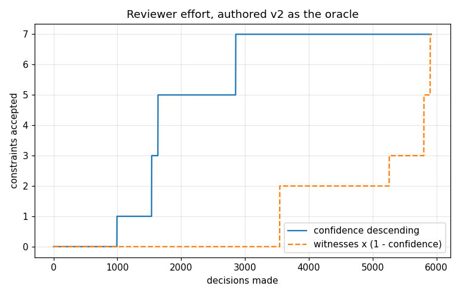

# Derivation search evaluation (P4c)

Every number here is rendered from `results/derivation_eval.jsonl`, one record per finding, each carrying the slice `content_hash` and the `code_revision` it was produced under. Regenerate with `python scripts/eval_derivation_search.py`. Search bounds throughout: `min_support=10`, `min_confidence=0.9`, `max_antecedent=2`, `max_path=2`.

## T1. Pruning ablation

Slice `real_wikidata_geography_1000`, small enough for the reference enumerator to score the whole space: 300 bodies against 348 heads, 2424 admitted with nothing pruned. Dominance is off in all four runs, so this is about the two pruning laws and nothing else.

| configuration | bodies | heads | admitted | 0.90-0.95 | 0.95-0.99 | 0.99-1.00 | lost above min_conf | runtime_s |
|---|---|---|---|---|---|---|---|---|
| neither | 300 | 348 | 2424 | 614 | 1 | 1809 | 0 | 0.0605 |
| support only | 99 | 348 | 2424 | 614 | 1 | 1809 | 0 | 0.0437 |
| head prefix only | 300 | 348 | 2424 | 614 | 1 | 1809 | 0 | 0.0607 |
| both | 99 | 348 | 2424 | 614 | 1 | 1809 | 0 | 0.0439 |

**Nothing above the confidence floor was lost in any configuration.** That is the claim the two laws make, and it is the claim this table exists to test: every configuration admitted exactly what the unpruned oracle admitted.

Runtimes are wall-clock on one machine and are the only figures here that will not reproduce exactly elsewhere.

## T2. Recovery against third-party constraints

Source: Wikidata P2302 property constraints, cached at `data/raw/constraints/wikidata_p2302.json` by `scripts/fetch_p2302.py`. 14 properties, 92 constraint statements.

The two counts the gate asks for are reported separately from the ones the fragment cannot state at all. Conflating them would report a modelling boundary as a failure to find something.

| category | count |
|---|---|
| constraint statements fetched | 92 |
| not expressible in this fragment or not generated by this search | 63 |
| expressible as a rule of one of the three shapes | 29 |
| expressible, but the predicate does not occur in any committed slice | 4 |
| **expressible and in scope** | 25 |
| **expressible and found** | 6 |
| **expressible and missed** | 19 |

Precision the other way round: 9 of 385 candidates across the scored slices correspond to a written constraint. That number is low by construction and should be read with care: the search proposes rules about a 1000-edge sample, while the written constraints describe the whole of Wikidata, so most candidates are about populations no written constraint mentions.

### What was found

| shape | predicate | matched_by | targets_total |
|---|---|---|---|
| domain | wdt:P171 | wd:Q16521 | 1 |
| range | wdt:P17 | wd:Q6256 | 26 |
| range | wdt:P171 | wd:Q16521 | 1 |
| requires | wdt:P105 | wdt:P171 | 1 |
| requires | wdt:P131 | wdt:P17 | 1 |
| requires | wdt:P171 | wdt:P105 | 1 |

### What was missed

| shape | predicate | targets | targets_total |
|---|---|---|---|
| domain | wdt:P105 | ['Q15707583', 'Q16521'] | 2 |
| domain | wdt:P206 | ['Q27096213', 'Q3238337', 'Q3895768', 'Q618123', 'Q66661745', 'Q8205328'] | 7 |
| domain | wdt:P30 | ['Q2221906', 'Q27096213', 'Q3694119', 'Q3895768', 'Q74817647'] | 5 |
| domain | wdt:P36 | ['Q1145276', 'Q1414991', 'Q1907114', 'Q20750954', 'Q23442', 'Q2775969'] | 15 |
| domain | wdt:P47 | ['Q15642541', 'Q2221906', 'Q3238337', 'Q3895768', 'Q4006', 'Q618123'] | 7 |
| domain | wdt:P828 | ['Q67518978'] | 1 |
| range | wdt:P105 | ['Q427626'] | 1 |
| range | wdt:P131 | ['Q15617994', 'Q15642541', 'Q19953632', 'Q245016', 'Q269528', 'Q30070324'] | 10 |
| range | wdt:P1376 | ['Q137834788', 'Q20750954', 'Q23442', 'Q56061', 'Q64034456', 'Q702492'] | 6 |
| range | wdt:P206 | ['Q15324', 'Q16500104', 'Q16615865', 'Q44782'] | 4 |
| range | wdt:P30 | ['Q17199338', 'Q5107', 'Q55833', 'Q855697'] | 4 |
| range | wdt:P36 | ['Q1048835', 'Q123349660', 'Q486972', 'Q5119', 'Q56061', 'Q64034456'] | 6 |
| range | wdt:P47 | ['Q15642541', 'Q3238337', 'Q3895768', 'Q4006', 'Q618123', 'Q8928'] | 6 |
| requires | wdt:P105 | ['wdt:P225'] | 1 |
| requires | wdt:P131 | ['wdt:P31'] | 1 |
| requires | wdt:P1376 | ['wdt:P131'] | 1 |
| requires | wdt:P1376 | ['wdt:P17'] | 1 |
| requires | wdt:P1376 | ['wdt:P625'] | 1 |
| requires | wdt:P171 | ['wdt:P225'] | 1 |

### What the fragment cannot state

| constraint_type | count | reason |
|---|---|---|
| Q21502838 | 10 | conflicts-with needs negation |
| Q21510851 | 6 | allowed-qualifiers is about statement structure, not the graph |
| Q21510855 | 3 | allowed-units is about literals, which set repairs cannot touch |
| Q21510859 | 2 | one-of enumerates allowed values; the search generates no value lists |
| Q21510862 | 1 | symmetric is a path constraint, boundary tier by Thm 11 |
| Q21510864 | 2 | value-requires-statement is a rule about the object, not the subject |
| Q25796498 | 3 | contemporary constraint compares time values |
| Q52004125 | 14 | allowed-entity-types is about the entity model, not the graph |
| Q52060874 | 2 | allowed-qualifiers variant, as above |
| Q52558054 | 5 | citation-needed is a sourcing rule, not a graph shape |
| Q53869507 | 14 | property-scope is about statement structure, not the graph |
| Q54554025 | 1 | single-best-value needs counting |

_YAGO SHACL: no SHACL shape file is committed and the YAGO 4.5 schema dump is not in the offline corpus, so the YAGO half of this comparison was not run._

## T3. Cross-source transfer

| domain | reference | vocabulary | candidates | untranslatable | stable | unstable | not_comparable | comparable | drop_median | drop_max |
|---|---|---|---|---|---|---|---|---|---|---|
| geography | real_dbpedia_geography_1000 | as derived | 249 | 0 | 0 | 0 | 249 | 0 | None | None |
| geography | real_dbpedia_geography_1000 | translated | 249 | 235 | 5 | 2 | 7 | 7 | 0.0 | 1.0 |
| taxa | real_yago_taxa_1000 | as derived | 136 | 0 | 0 | 0 | 136 | 0 | None | None |
| taxa | real_yago_taxa_1000 | translated | 136 | 128 | 8 | 0 | 0 | 8 | 0.0 | 0.0 |

**geography, as derived, against `real_dbpedia_geography_1000`.** Shared predicates: none. Confidence-drop distribution over the 0 comparable candidates: none comparable.

**geography, translated, against `real_dbpedia_geography_1000`.** Shared predicates: none. Confidence-drop distribution over the 7 comparable candidates: 0.75-1.00 2, no drop 5.

**taxa, as derived, against `real_yago_taxa_1000`.** Shared predicates: none. Confidence-drop distribution over the 0 comparable candidates: none comparable.

**taxa, translated, against `real_yago_taxa_1000`.** Shared predicates: none. Confidence-drop distribution over the 8 comparable candidates: no drop 8.

### Over-broad rules of the RC1 shape

Not a reconstruction of the RC1 shape but the case itself: the authored anatomy rules whose over-breadth the C1 investigation traced, plus the v2 rule that fixed one of them as a contrast. Each is scored on its home slice and on the geography slice that the shared part-of predicate drags in. Named individually.

- **ana.wd.dom.partof (v1).** part-of is reused for geographic containment, so this anatomy-scoped rule also claims that every place that is part of another place is an anatomical structure. On the anatomy slice: confidence 0.1343 over 67 judged node(s). On the geography slice, which the shared predicate drags in: 0.0 over 20. Stability verdict: **unstable** (scored on 20 reference node(s); confidence gap 0.134328 against a delta of 0.1). Discarded by the gate: True.
- **ana.wd.rng.partof (v1).** the same reuse read from the object end. On the anatomy slice: confidence 0.058 over 69 judged node(s). On the geography slice, which the shared predicate drags in: None over None. Stability verdict: **not_comparable** (no node in the reference antecedent leads the head, so there is no denominator to score against). Discarded by the gate: False.
- **ana.wd.dom.partof.v2 (fixed).** the C1 fix, which scopes the antecedent so the geographic population is no longer claimed. Included as the contrast case. On the anatomy slice: confidence 0.9706 over 34 judged node(s). On the geography slice, which the shared predicate drags in: None over None. Stability verdict: **not_comparable** (the antecedent matches 0 node(s) in the reference, below the floor of 10, so the reference has nothing to say about this rule). Discarded by the gate: False.

## T4. Recovery against the authored sets

Weaker evidence than T2 and reported second for that reason: agreement with one author's choices on one slice is a narrow yardstick, and the author of the constraints and the author of the search are the same person. The third-party comparison is the one that carries weight.

| domain | kg | version | slice | authored_core | recovered | recall | candidates |
|---|---|---|---|---|---|---|---|
| geography | wikidata | 1 | real_wikidata_geography_1000 | 4 | 1 | 0.25 | 249 |
| geography | wikidata | 2 | real_wikidata_geography_1000 | 4 | 1 | 0.25 | 249 |
| taxa | wikidata | 1 | real_wikidata_taxa_1000 | 4 | 2 | 0.5 | 136 |
| taxa | wikidata | 2 | real_wikidata_taxa_1000 | 4 | 2 | 0.5 | 136 |
| anatomy | wikidata | 1 | real_wikidata_anatomy_1000_typed | 2 | 2 | 1.0 | 3421 |
| anatomy | wikidata | 2 | real_wikidata_anatomy_1000_typed | 2 | 0 | 0.0 | 3421 |
| disease | wikidata | 1 | real_wikidata_disease_1000 | 2 | 0 | 0.0 | 35 |
| disease | wikidata | 2 | real_wikidata_disease_1000 | 2 | 0 | 0.0 | 35 |
| medication | wikidata | 1 | real_wikidata_medication_1000_typed | 3 | 1 | 0.3333 | 2078 |
| medication | wikidata | 2 | real_wikidata_medication_1000_typed | 3 | 1 | 0.3333 | 2078 |

### Every authored constraint no candidate reproduces

| domain | version | cid | kind | antecedent_matches | classification |
|---|---|---|---|---|---|
| geography | 1 | geo.wd.dom.country | existential_domain | 41 | a genuine gap: the antecedent is frequent enough and the shape is in the space, but no candidate matched |
| geography | 1 | geo.wd.type.city | typing_existence | 27 | a genuine gap: the antecedent is frequent enough and the shape is in the space, but no candidate matched |
| geography | 1 | geo.wd.req.city_country | requires_statement | 10 | a genuine gap: the antecedent is frequent enough and the shape is in the space, but no candidate matched |
| geography | 2 | geo.wd.dom.country | existential_domain | 41 | a genuine gap: the antecedent is frequent enough and the shape is in the space, but no candidate matched |
| geography | 2 | geo.wd.type.city | typing_existence | 27 | a genuine gap: the antecedent is frequent enough and the shape is in the space, but no candidate matched |
| geography | 2 | geo.wd.req.city_country | requires_statement | 10 | a genuine gap: the antecedent is frequent enough and the shape is in the space, but no candidate matched |
| taxa | 1 | tax.wd.inherit.taxon | typing_inheritance | None | outside the search space: the antecedent or consequent is a shape the generator never emits |
| taxa | 1 | tax.wd.req.rank | requires_statement | 24 | a genuine gap: the antecedent is frequent enough and the shape is in the space, but no candidate matched |
| taxa | 2 | tax.wd.inherit.taxon | typing_inheritance | None | outside the search space: the antecedent or consequent is a shape the generator never emits |
| taxa | 2 | tax.wd.req.rank | requires_statement | 24 | a genuine gap: the antecedent is frequent enough and the shape is in the space, but no candidate matched |
| anatomy | 2 | ana.wd.dom.partof.v2 | existential_domain | None | outside the search space: the antecedent or consequent is a shape the generator never emits |
| anatomy | 2 | ana.wd.rng.partof.v2 | existential_range | None | outside the search space: the antecedent or consequent is a shape the generator never emits |
| disease | 1 | dis.wd.dom.symptom | existential_domain | 7 | below the support floor: the antecedent matches 7 node(s) on this slice, against a floor of 10 |
| disease | 1 | dis.wd.req.cause_or_symptom | requires_statement | 0 | below the support floor: the antecedent matches 0 node(s) on this slice, against a floor of 10 |
| disease | 2 | dis.wd.dom.symptom.v2 | existential_domain | 7 | below the support floor: the antecedent matches 7 node(s) on this slice, against a floor of 10 |
| disease | 2 | dis.wd.req.cause_or_symptom.v2 | requires_statement | 16 | a genuine gap: the antecedent is frequent enough and the shape is in the space, but no candidate matched |
| medication | 1 | med.wd.dom.treats | existential_domain | 12 | a genuine gap: the antecedent is frequent enough and the shape is in the space, but no candidate matched |
| medication | 1 | med.wd.req.route | requires_statement | 10 | a genuine gap: the antecedent is frequent enough and the shape is in the space, but no candidate matched |
| medication | 2 | med.wd.dom.treats.v2 | existential_domain | 12 | a genuine gap: the antecedent is frequent enough and the shape is in the space, but no candidate matched |
| medication | 2 | med.wd.req.route.v2 | requires_statement | 363 | a genuine gap: the antecedent is frequent enough and the shape is in the space, but no candidate matched |

## T5. Reviewer effort

Pooled over every slice with an authored set: 5919 candidates, 7 of which the authored v2 sets accept.

| domain | slice | candidates | oracle_accepts |
|---|---|---|---|
| geography | real_wikidata_geography_1000 | 249 | 1 |
| taxa | real_wikidata_taxa_1000 | 136 | 4 |
| anatomy | real_wikidata_anatomy_1000_typed | 3421 | 0 |
| disease | real_wikidata_disease_1000 | 35 | 0 |
| medication | real_wikidata_medication_1000_typed | 2078 | 2 |

| ordering | decisions to half the accepts | decisions to all the accepts |
|---|---|---|
| confidence descending | 1636 | 2855 |
| witnesses x (1 - confidence) | 5803 | 5903 |

**Limitation, stated with the result rather than after it:** the oracle is the authored v2 set, so this measures agreement with one author's choices, not what a reviewer would actually decide. A reviewer who disagreed with the authored set would produce a different curve, and nothing here measures whether the authored set is right.
